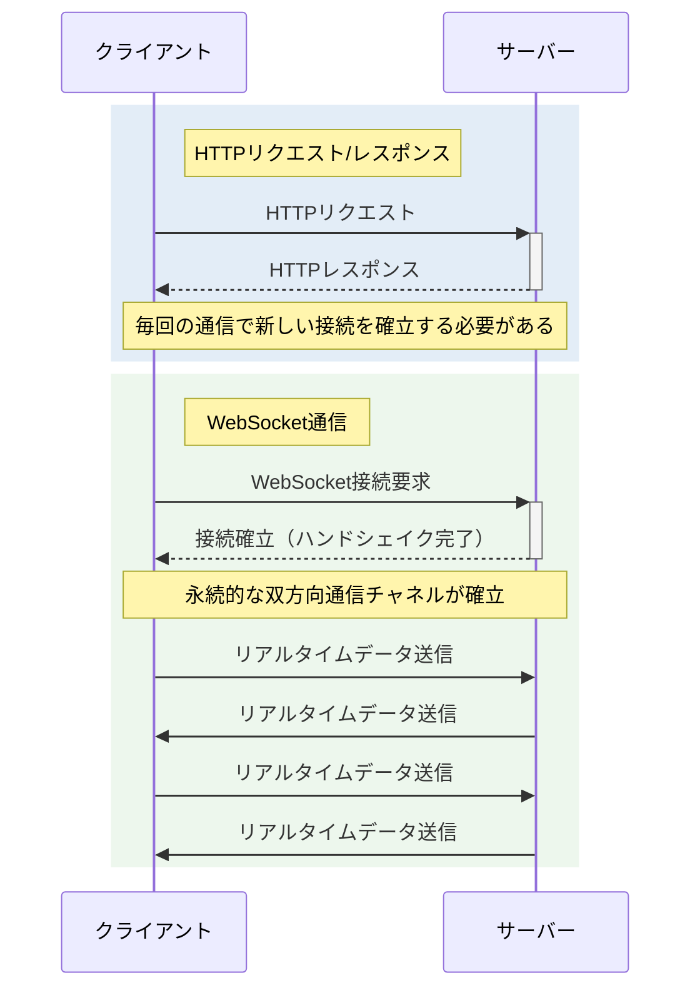
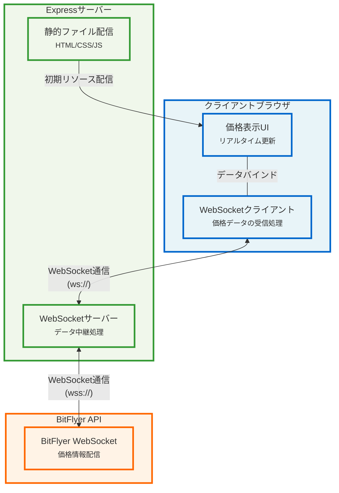
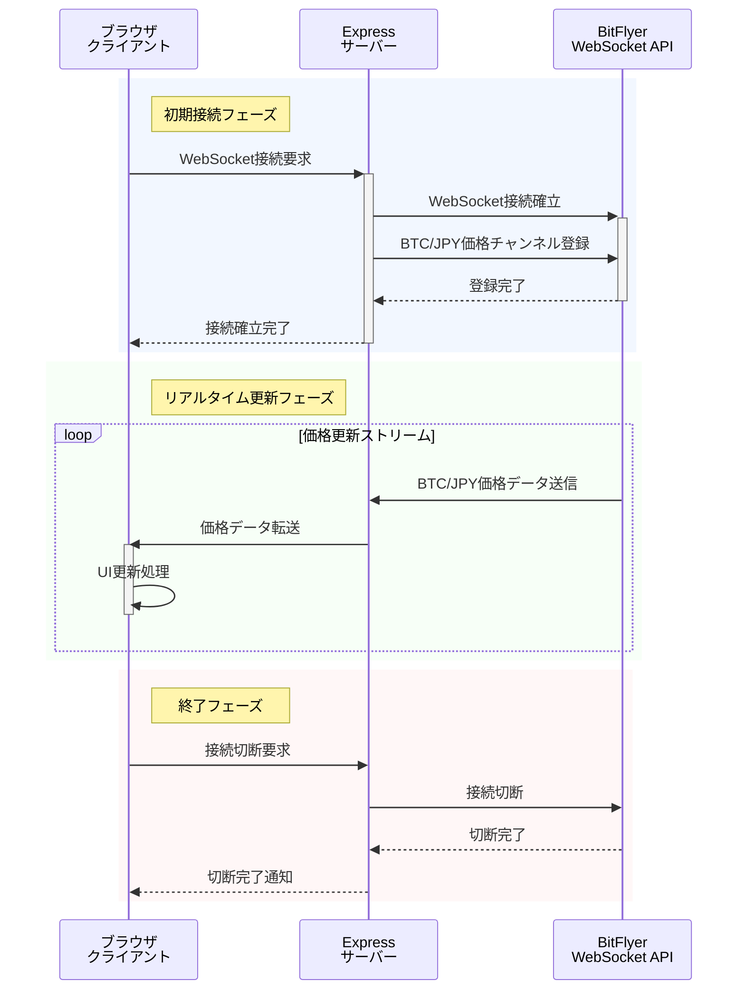

# 🌐 WebSocketの仕組みと実用例

## 📚 WebSocketとは

WebSocketは、クライアントとサーバー間で双方向のリアルタイム通信を可能にするプロトコルです。
従来のHTTP通信と異なり、一度接続を確立すると、クライアントとサーバーの両方が自由にデータを送受信できます。

## 🔄 HTTPとWebSocketの違い



### 主な特徴

1. **双方向通信**：クライアントとサーバーの両方が自由にデータを送信可能
2. **リアルタイム性**：低レイテンシーでのデータ転送が可能
3. **効率性**：HTTPと比較してオーバーヘッドが少ない
4. **永続的接続**：一度確立した接続を維持

## 💡 一般的なユースケース

1. **リアルタイム価格情報**
   - 株価・仮想通貨の価格表示
   - 為替レートの更新

2. **チャットアプリケーション**
   - メッセージのリアルタイム送受信
   - オンラインステータスの更新

3. **オンラインゲーム**
   - プレイヤー間のリアルタイム通信
   - ゲーム状態の同期

4. **IoTデバイスモニタリング**
   - センサーデータのリアルタイム監視
   - デバイスステータスの更新

## 🔍 実装例：BitFlyer価格表示システム

### システムアーキテクチャ



### データフロー



### 実装の主要コンポーネント

1. **サーバーサイド実装（Node.js + Express + ws）**
```javascript
// WebSocketサーバーの設定
const wss = new WebSocket.Server({ server });

// クライアント接続時の処理
wss.on('connection', function connection(ws) {
    // BitFlyerのWebSocket接続
    const bitflyerWs = new WebSocket('wss://ws.lightstream.bitflyer.com/json-rpc');
    
    // データ受信時の転送処理
    bitflyerWs.on('message', function incoming(data) {
        ws.send(data.toString());
    });
});
```

2. **クライアントサイド実装（JavaScript）**
```javascript
const ws = new WebSocket(`ws://${window.location.hostname}:3000`);

ws.onmessage = function(event) {
    const data = JSON.parse(event.data);
    if (data.params && data.params.message) {
        const ticker = data.params.message;
        // 価格表示の更新
        document.getElementById('price').textContent = 
            new Intl.NumberFormat('ja-JP').format(ticker.ltp) + ' 円';
    }
};
```

## 📝 まとめ

WebSocketは、リアルタイムデータ更新が必要なアプリケーションに最適なプロトコルです。
本実装例では、以下の利点を活用しています：

1. **リアルタイム性**: 価格情報をミリ秒単位で更新
2. **効率性**: 必要な時だけデータを転送
3. **スケーラビリティ**: 多数のクライアントに対応可能
4. **信頼性**: 接続断時の自動再接続機能

WebSocketを活用することで、従来のポーリング方式と比較して、より効率的でリアルタイムな通信が実現可能となります。